<div align="center">

# 📤 Google Drive Upload MCP Server

**あらゆるサイズのファイルを、MCP クライアントから Google Drive へ — JSON-RPC ではなく素の HTTP で直接アップロード。**

[](LICENSE)
[](https://workers.cloudflare.com/)
[](https://www.typescriptlang.org/)
[](https://modelcontextprotocol.io/)
[](CONTRIBUTING.md)

[](README.md)
[](README.en.md)

</div>

---

[Cloudflare Worker](https://workers.cloudflare.com/) 上で動く Model Context Protocol (MCP) サーバーです。MCP クライアント (Claude Desktop / Cowork など) から、**ユーザー本人の Google Drive** へファイルをアップロードできます。

設計の肝は **制御プレーン / データプレーン分離**です。ファイル本体は MCP/JSON-RPC を通りません。サーバーは短命の署名付き URL をクライアントに渡し、クライアントはその専用 HTTP エンドポイントへ生のバイト列を直接 `PUT` します。Worker はそれを Google Drive へストリームリレーします。

<div align="center">
  
</div>

## ✨ この設計の利点

| | |
|---|---|
| 🚀 **大容量ファイル** | バイト列が JSON-RPC を経由せず Drive へ直接ストリーム。base64 肥大もメッセージサイズ制限もなし。 |
| 🔐 **アップロード単位の認証情報** | アップロードごとに、単一の `uploadId` / `userId` / サイズ / content-type / SHA-256 に紐づく短命 JWT を発行。 |
| 🧮 **エンドツーエンドの整合性** | Worker がストリーム中に SHA-256 を計算し、Drive へのリレー完了後に照合。不一致なら Drive のファイルを削除(best-effort)。 |
| 🪪 **ユーザー所有のストレージ** | OAuth 2.1、upstream IdP は Google。ファイルは*ユーザー自身*の Drive (`drive.file` スコープ) に保存され、運用者は中身を読めない。 |
| 🧩 **2 つの小さなツール** | `prepare_upload` と `complete_upload` だけが操作面。 |

## 🌐 必要要件: エージェントが送信先への egress を許可できること

ファイル本体は、エージェントの実行環境から `/upload/:id`(データプレーン)への **直接の HTTPS `PUT`** で送られます。そのため、エージェントの環境が**あなたの Worker ドメインへの外向き通信を許可**でき、かつ **`PUT` メソッドを許可**している必要があります(サンドボックスによっては、許可ドメインでも読み取り系メソッドしか通さないことがあります)。

目安:

- **ローカル実行のエージェント**(Claude Code / Codex CLI / Gemini CLI)は自分のマシンで動くため、ほぼ確実に egress を許可設定できる(または既に許可されている)。
- **クラウド / サンドボックス型のエージェント**は、ドメイン許可リストを設定でき、**かつ読み取り以外のメソッドを許可**している場合のみ利用可能。外向き通信を完全に遮断するものも多い。

| エージェント | 実行形態 | egress / ドメイン許可 | 利用可否 |
|---|---|---|---|
| **[Claude Code](https://code.claude.com/docs/en/sandboxing)** | ローカル CLI | 許可モード: *None* / *パッケージマネージャ + カスタム* / *All*。Enterprise は管理ドメインを固定可 | ✅ 自分のドメインを追加(または非サンドボックスで実行) |
| **[OpenAI Codex CLI](https://developers.openai.com/codex/concepts/sandboxing)** | ローカル CLI | `workspace-write` では既定でネットワーク off。有効化し allow ルールを追加(`config.toml` → `network_proxy`) | ✅ ネットワーク有効化 + ドメイン許可 |
| **[Gemini CLI](https://geminicli.com/docs/cli/sandbox/)** | ローカル CLI | `*-proxied` サンドボックスプロファイル + 許可リスト | ✅ proxied プロファイル + ドメイン許可 |
| **[Claude — Cowork / claude.ai コネクタ](docs/introduce.md)** | クラウド / デスクトップ agent | 「ネットワーク外部通信を許可」+ *追加の許可ドメイン* | ✅ 自分のドメインを追加([docs/introduce.md](docs/introduce.md) 参照) |
| **[OpenAI Codex(クラウド / web)](https://developers.openai.com/codex/cloud/internet-access)** | クラウドサンドボックス | 既定で off。許可リストプリセットあり。GET/HEAD/OPTIONS のみに制限される場合あり | ⚠️ ドメイン許可に加え、**読み取り専用メソッド制限で `PUT` が塞がれていない**ことを要確認 |
| egress 設定を**持たない**サンドボックス agent | クラウド | なし | ❌ アップロードエンドポイントへ到達不可 |

> egress が許可されていないと `PUT` は失敗します(Claude では `cowork-egress-blocked` として表示)。`prepare_upload` / `complete_upload` の呼び出しは MCP トランスポートを通るので成功しますが、ファイル本体を送れません。

> **⚠️ 動作確認済みは Claude(claude.ai / Cowork コネクタ)のみです。** 表内の他のエージェントは各サンドボックスの公開ドキュメントからの推定で、メンテナによる**検証はしていません**。他のエージェントでの動作報告・PR を歓迎します。

## 🛠️ MCP ツール

| ツール | 入力 | 出力 |
| --- | --- | --- |
| `prepare_upload` | `{ filename, size, contentType, sha256?, parentFolderId? }` | `{ uploadId, uploadUrl, uploadToken, expiresAt }` |
| `complete_upload` | `{ uploadId, sha256 }` | `{ fileId, resourceUri, name, mimeType, size, sha256 }` |
| `search_files` | `{ query?, pageSize?, pageToken? }` | `{ files: [...], nextPageToken? }` |
| `get_file_metadata` | `{ fileId }` | `{ id, name, mimeType, size?, modifiedTime? }` |
| `download_file` | `{ fileId }` | `{ downloadId, downloadUrl, downloadToken, expiresAt, name, mimeType, size? }` |
| `delete_file` | `{ fileId }` | `{ deleted, fileId }` |

実際のファイル転送は、ツール呼び出しの**間**に行う通常の HTTPS 転送です(→ [使い方](#-使い方))。
アップロードは `uploadUrl` への `PUT`、ダウンロードは `download_file` が返す `downloadUrl` への
`GET`(`Authorization: Bearer <downloadToken>`)。**バイトは MCP チャネルを通らない**ため大きいファイルでも
モデルのコンテキストを汚しません。詳細は [docs/mcp-tools.md](docs/mcp-tools.md)。

> 検索・閲覧・ダウンロードには `drive.readonly` スコープが必要です。導入時に `GOOGLE_OAUTH_SCOPES`
> を設定し、スコープ変更後は既存ユーザーの**再認証(再同意)**が必要になります。

## 🏗️ アーキテクチャ

- **`/mcp`** — `McpAgent` (Durable Object) による Streamable HTTP MCP。[`@cloudflare/workers-oauth-provider`](https://github.com/cloudflare/workers-oauth-provider) の Bearer 認証で保護。
- **`/upload/:uploadId`** — データプレーン。クライアントがファイル本体を `PUT` し、Worker が SHA-256 を計算しつつ Google Drive resumable session へストリームリレー。
- **`/authorize`, `/callback`, `/oauth/token`, `/oauth/register`** — OAuth 2.1。upstream IdP は Google。

設計根拠の全体は [`docs/SPEC.md`](docs/SPEC.md) を参照。

## 🧰 mcp-upload-kit との関係

この repo は [`mcp-upload-kit`](https://github.com/zenk-t-suzuki/mcp-upload-kit) の Google Drive 実装例の元になった実装です。アップロード全体の制御、Google OAuth、Drive resumable upload、MCP tool 定義はこの repo に残し、JWT、SHA-256 stream、`Content-Range`、JSON response、KV key などの汎用 primitive だけを `mcp-upload-kit` に切り出しています。

## 🚀 セットアップ

```bash
npm install --legacy-peer-deps

# KV 名前空間を 3 つ作成し、各 id を wrangler.jsonc に貼る
wrangler kv namespace create UPLOAD_KV
wrangler kv namespace create TOKEN_KV
wrangler kv namespace create OAUTH_KV

# シークレット (本番)
wrangler secret put JWT_SIGNING_KEY     # 例: openssl rand -base64 48
wrangler secret put GOOGLE_CLIENT_ID
wrangler secret put GOOGLE_CLIENT_SECRET
wrangler secret put COOKIE_SECRET       # 例: openssl rand -base64 32
```

ローカル開発では env テンプレートをコピー (gitignored):

```bash
cp .dev.vars.example .dev.vars   # 値を記入
npm run dev                       # http://localhost:8787
```

デプロイ手順の全体 (Google Cloud Console 設定 / KV id / `WORKER_BASE_URL`) は **[`docs/deploy.md`](docs/deploy.md)**。
デプロイ済みサーバーへの接続手順は **[`docs/introduce.md`](docs/introduce.md)**。

## 📥 使い方

1. MCP クライアントに `{WORKER_BASE_URL}/mcp` を Streamable HTTP MCP として登録。
2. 初回接続時に Google ログイン → Drive スコープを承認。
3. `prepare_upload` を呼び `uploadUrl` / `uploadToken` / `uploadId` を取得。
4. ファイル本体を `PUT`:
   ```bash
   curl -X PUT "$uploadUrl" \
        -H "Authorization: Bearer $uploadToken" \
        -H "Content-Type: $contentType" \
        -H "Content-Length: $size" \
        --data-binary @./file.bin
   ```
5. `complete_upload` を呼び、SHA-256 検証と `fileId` / `resourceUri` (`gdrive://files/<id>`) を取得。

## 📜 スクリプト

| スクリプト | 説明 |
| --- | --- |
| `npm run dev` | `wrangler dev` (http://localhost:8787) |
| `npm run deploy` | `wrangler deploy` |
| `npm run typecheck` | `tsc --noEmit` |
| `npm test` | Vitest ユニットテスト (jwt / sha256 / handlers) |
| `npm run docs:build` | `docs/diagrams/*.mmd` → SVG を再生成 |

## 📚 ドキュメント

| トピック | ファイル |
|---|---|
| 仕様・設計根拠 | [docs/SPEC.md](docs/SPEC.md) |
| アーキテクチャ | [docs/architecture.md](docs/architecture.md) |
| MCP ツール | [docs/mcp-tools.md](docs/mcp-tools.md) |
| アップロードフロー | [docs/upload-flow.md](docs/upload-flow.md) |
| 認証 | [docs/auth.md](docs/auth.md) |
| データモデル | [docs/data-model.md](docs/data-model.md) |
| セキュリティ / 脅威モデル | [docs/security.md](docs/security.md) |
| デプロイガイド | [docs/deploy.md](docs/deploy.md) |
| クライアント接続ガイド | [docs/introduce.md](docs/introduce.md) |

## ⚠️ 制限・既知の事項

- 単一 `PUT` のサイズは Cloudflare Workers の上限まで (`MAX_UPLOAD_BYTES`)。それ以上はチャンク分割 `PUT` に対応。
- `delete_file` は `drive.file` スコープのため、このサーバー経由で作成したファイルのみ削除可能。
  一方 `search_files` / `get_file_metadata` / `download_file` は `drive.readonly` でユーザーの Drive 全体が対象。
- `download_file` は Google ネイティブ形式 (Docs/Sheets/Slides 等) を直接 DL 不可（エクスポート未対応）。
- KV は結果整合。`prepare_upload` 直後の `complete_upload` で稀に再試行が要る場合あり。

## 🤝 コントリビュート

Issue / PR を歓迎します → [CONTRIBUTING.md](CONTRIBUTING.md)。セキュリティ報告は [SECURITY.md](SECURITY.md) を参照。

## 📄 ライセンス

[MIT](LICENSE) © ZENK Co., Ltd.
