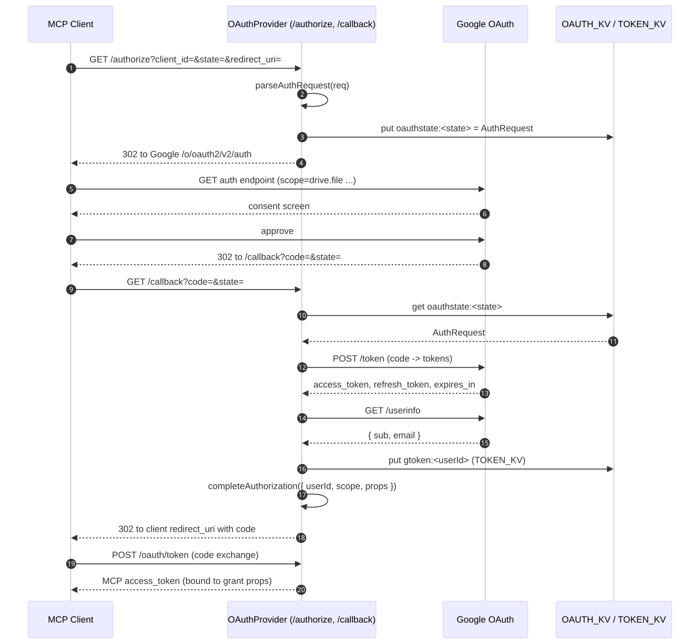

# Authentication

[← SPEC.md に戻る](./SPEC.md)

`@cloudflare/workers-oauth-provider` を Authorization Server として動かし、upstream IdP を Google にしてユーザー認証と Drive スコープ取得を兼ねる。

## フロー全体



ソース: [diagrams/oauth-sequence.mmd](./diagrams/oauth-sequence.mmd)

## 役割分担

| 役割 | 担当 |
|---|---|
| MCP クライアント向け OAuth 2.1 AS | `OAuthProvider` ([src/index.ts](../src/index.ts)) |
| 同意・ログイン UI | upstream Google (本サーバーは独自ログイン画面を持たない) |
| Google IdP との code 交換 / userinfo 取得 | [src/auth/google.ts](../src/auth/google.ts) |
| Google access/refresh token 保管とリフレッシュ | [src/auth/tokens.ts](../src/auth/tokens.ts) |

## エンドポイント

| パス | メソッド | 役割 |
|---|---|---|
| `/authorize` | GET | OAuth リクエスト受領 → state 保存 → Google にリダイレクト |
| `/callback` | GET | Google からのリダイレクト着地 → code 交換 → `completeAuthorization` |
| `/oauth/token` | POST | クライアントへの access token 発行 (OAuthProvider 標準) |
| `/oauth/register` | POST | Dynamic Client Registration (OAuthProvider 標準) |

## Google から要求するスコープ

`WORKER_BASE_URL` で定義する `GOOGLE_OAUTH_SCOPES`:

```
openid
email
profile
https://www.googleapis.com/auth/drive.file
```

`drive.file` は **本サーバー経由で作成または明示的に開かれたファイルのみ** に権限を限定する最小権限のスコープ。ユーザーの既存ファイルには触れない。

## トークンの保管

### Google access/refresh token

- 保管先: `TOKEN_KV` の `gtoken:<userId>` キー
- 値: `{ accessToken, refreshToken, expiresAt, scope }`
- リフレッシュ: `getFreshAccessToken()` が `expiresAt - 60` を過ぎていれば `refresh_token` で更新し KV を書き戻す
- 失効: Google 側で revoke されると次回リフレッシュが 4xx で失敗。ユーザー側で再度 `/authorize` する必要がある

### OAuth state

- 保管先: `OAUTH_KV` の `oauthstate:<state>` キー (TTL 10 分)
- 値: `parseAuthRequest()` が返す `AuthRequest` JSON
- 用途: `/callback` で state 検証 (CSRF 対策) + 元の OAuth リクエストを復元

### Grant (OAuthProvider 内部)

- OAuthProvider が自身で `OAUTH_KV` に grant とクライアント情報を保管
- `completeAuthorization({ userId, scope, props })` を呼ぶと、`props` が grant にバインドされ、`/mcp` への Bearer 検証時に `ctx.props` として伝搬される
- McpAgent はそれを `_init` で受け取り、`getMcpAuthContext().props` から `userId` / `email` を読める

## props の中身

```ts
interface UserProps {
  userId: string;   // Google "sub" claim
  email: string;
}
```

`userId` がそのまま `TOKEN_KV` のキー、`UPLOAD_KV` レコードの `userId` フィールド、JWT の `sub` クレームになる。これで MCP・Upload handler・Google アカウントが 1 本に紐づく。

## Google Cloud Console 側の設定

1. OAuth 2.0 クライアント ID (種別: Web application) を作成
2. 承認済みリダイレクト URI に `{WORKER_BASE_URL}/callback` を登録 (ローカル開発時は `http://localhost:8787/callback` も追加)
3. OAuth 同意画面でスコープ `.../auth/drive.file` を有効化、テストモードならテストユーザーを追加
4. 取得した `client_id` / `client_secret` を `wrangler secret put` で投入

## 再認可が必要なタイミング

- ユーザーが Google アカウント側で本アプリの権限を取り消した
- `refresh_token` が期限超過 (Google は 6 ヶ月未使用などで失効)
- `GOOGLE_OAUTH_SCOPES` を増やしたとき (旧 grant では新スコープが取れない)
