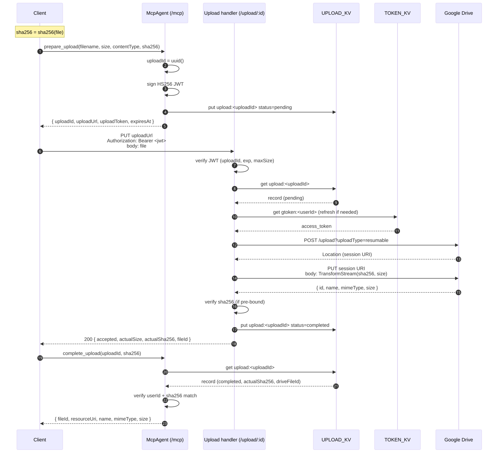
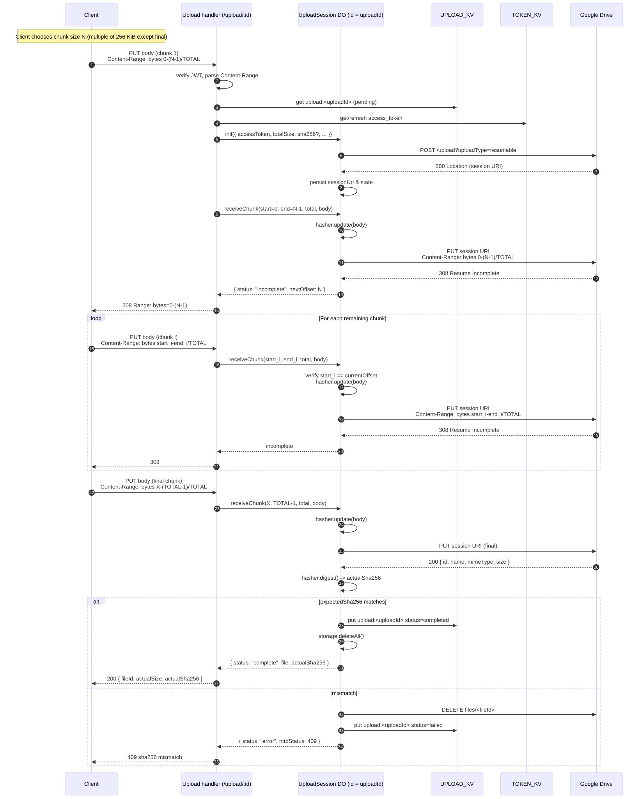

# Upload Flow

[← SPEC.md に戻る](./SPEC.md)

データプレーンの全体像。実装は [src/upload/handler.ts](../src/upload/handler.ts)。

## エンドツーエンドのシーケンス

ソース: [diagrams/upload-sequence.mmd](./diagrams/upload-sequence.mmd)

## 状態遷移

ソース: [diagrams/upload-state.mmd](./diagrams/upload-state.mmd)

`UploadRecord.status` は `pending → completed | failed` の単方向。`failed` は再試行できず、新しい `uploadId` を発行し直す。

## PUT `/upload/:uploadId` の処理ステップ

| 段階 | 動作 | 失敗時 |
|---|---|---|
| 1. Method/Auth ヘッダ検証 | `PUT` で `Authorization: Bearer <jwt>` を要求 | 401 / 405 |
| 2. JWT 検証 | HMAC 署名・`exp`・`iss/aud` をチェック | 401 |
| 3. パス整合性 | JWT の `uploadId` とパスの `:uploadId` が一致するか | 401 |
| 4. Content-Length 検証 | ヘッダから取り出し、`maxSize` 以下か | 411 / 413 |
| 5. KV 参照 | `upload:<uploadId>` を取得、`status === "pending"` を確認 | 404 / 409 |
| 6. ユーザー照合 | `record.userId === jwt.sub` | 403 |
| 7. Google アクセストークン取得 | `TOKEN_KV` から取得し、必要なら refresh | 500 |
| 8. Drive resumable session 初期化 | `POST .../files?uploadType=resumable` → `Location` ヘッダ取得 | 502 |
| 9. ストリームリレー | `request.body.pipeThrough(shaCountingStream)` を Drive に PUT | 502 (Drive session を cancel) |
| 10. SHA-256 照合 | 事前バインド `sha256` と一致 | 409 (Drive ファイルを delete) |
| 11. KV 更新 | `status=completed`, `actualSize`, `actualSha256`, `driveFileId` を書き込み (TTL 24h) | — |
| 12. レスポンス | `200 { accepted, actualSize, actualSha256, fileId }` | — |

## ストリーミング SHA-256

WebCrypto の `crypto.subtle.digest()` はワンショットで巨大ファイルに不向き。
`@noble/hashes/sha256` の `sha256.create()` で実装する `TransformStream`:

- `transform(chunk)` で `hasher.update(chunk)` と累積バイト数加算
- 加算結果が `maxBytes` を超えた瞬間に `controller.error()` でストリームを切る
- `flush()` で `hasher.digest()` を確定
- 別途 `finalize()` で hex 文字列とサイズを取り出せる

`request.body.pipeThrough(stream)` した後の `ReadableStream` をそのまま `fetch(driveSessionUri, { body: ... })` に渡すことで、Worker メモリにフルバッファを保持せず Drive まで中継する。

## エラー時のロールバック

| ケース | アクション |
|---|---|
| Drive resumable init 失敗 | KV 状態は `pending` のまま。TTL で自然失効 |
| Drive PUT 失敗 (途中切断含む) | `cancelDriveSession()` で session URI に `DELETE` を送信。KV を `failed` に更新 |
| SHA-256 不一致 | `deleteDriveFile()` で Drive 上のファイルを削除。KV を `failed` に更新 |
| サイズ超過 | `TransformStream` がエラーになり Drive PUT も失敗。上記の Drive PUT 失敗と同じパス |

`failed` の場合、クライアントは `complete_upload` を呼んでも `isError` で拒否される。新しい `uploadId` を取得して再試行する。

## チャンク分割アップロード (Content-Range)

単一 PUT のサイズ上限を超える場合、クライアントは `Content-Range` ヘッダ付きで複数回 PUT を送れる。
Worker は `UploadSession` Durable Object (uploadId ごとに 1 インスタンス) を介して Drive の同一 resumable session URI にチャンクを順次中継する。

### ディスパッチルール

`Content-Range` ヘッダの有無で経路が分岐する:

| Content-Range | 経路 |
|---|---|
| 無し | 単一 PUT (従来のストリームリレー) |
| `bytes 0-(N-1)/N` (全範囲) | 単一 PUT にフォールバック (DO を経由しない) |
| 部分 (`bytes X-Y/TOTAL`, Y < TOTAL-1) | チャンク経路 |

### チャンク経路のシーケンス

ソース: [diagrams/chunked-sequence.mmd](./diagrams/chunked-sequence.mmd)

### UploadSession DO の責務

`src/upload/session.ts` で定義。各 uploadId につき 1 インスタンス (`env.UPLOAD_SESSION.idFromName(uploadId)`)。

- **`init({ accessToken, totalSize, contentType, filename, parents?, expectedSha256? })`**: 初回チャンク時に呼ぶ。Drive resumable session を発行し session URI と `currentOffset=0` を DO ストレージに永続化。冪等 (2 回目以降は既存 state を返す)
- **`receiveChunk({ start, end, total, accessToken, body })`**: 各チャンクに対し:
  - `start === currentOffset` を検証 (順序不正は 409)
  - `body` を in-memory ハッシャに `update` (`@noble/hashes/sha256`)
  - Drive session URI に `Content-Range: bytes start-end/total` で PUT 中継
  - Drive レスポンス:
    - **308 Resume Incomplete** → `currentOffset = end+1` を永続化、`{ status: "incomplete", nextOffset }` を返す
    - **200/201** (最終チャンク完了) → `hasher.digest()` で sha256 確定、`expectedSha256` と照合、`UPLOAD_KV` を `completed` に更新、DO ストレージを clear
    - **4xx/5xx** → `UPLOAD_KV` を `failed` に更新

### SHA-256 の扱い

ハッシャは DO メモリ上に保持。DO がチャンク間でハイバネートすると in-memory hasher が消失するため、その場合は `hasherValid=false` にフォールバックし sha256 検証を無効化、`UPLOAD_KV` の `failureReason` に「hasher invalidated mid-upload」を記録する。実運用では数秒〜数分間隔のチャンクであれば DO は常駐する想定。長時間中断するケースでは新しい `uploadId` を切り直す。

### Drive 側のチャンクサイズ制約

- 非最終チャンクは **256 KiB の倍数** が必要 (Google Drive 仕様)
- 最終チャンクは任意サイズ可
- 違反した場合、Drive が 4xx を返し、Worker はそれを 502 として伝播

## 既知の制限

- KV は eventually consistent。`prepare_upload` 直後の `PUT /upload` でレコードが見えないケースがレアに発生する。クライアントは数百 ms のリトライで吸収する想定
- 並列チャンク送信 (out-of-order) は未対応。チャンクは順序 (start === currentOffset) で送る必要がある
- DO ハイバネート時の sha256 検証スキップは現時点では妥協。将来は @noble/hashes の内部状態を永続化して救済予定
